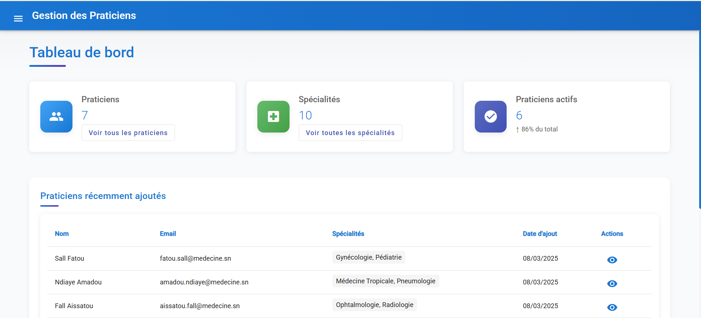
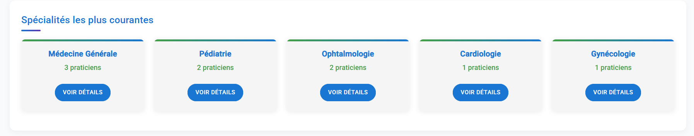
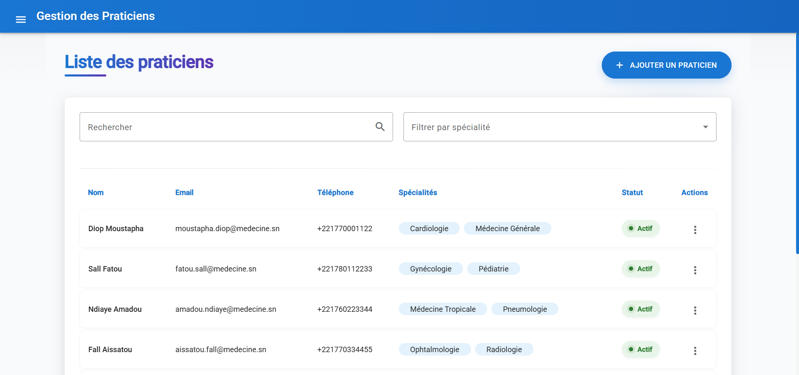
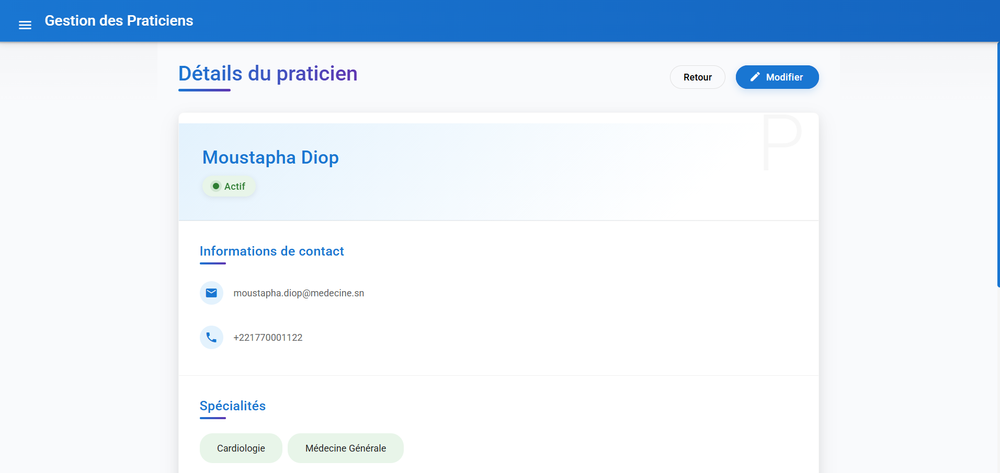
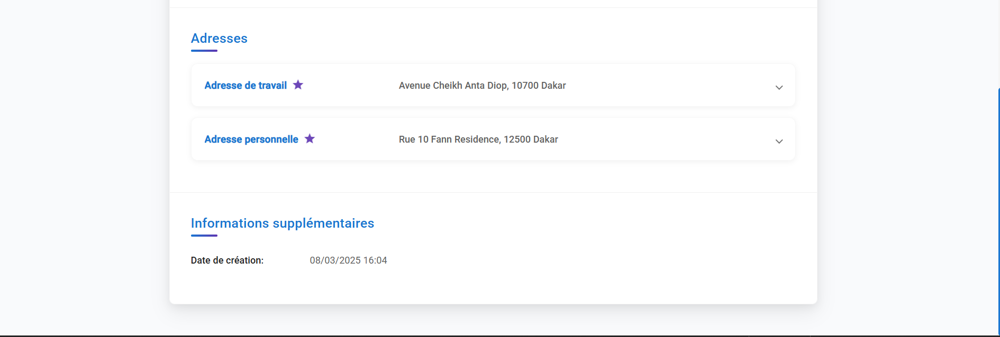
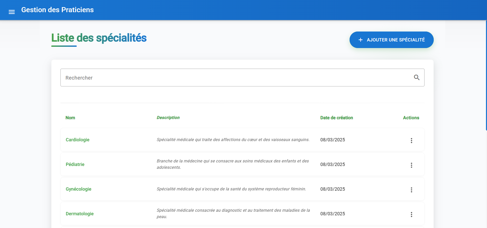

# Application Frontend Praticien

Une interface utilisateur moderne et responsive pour la gestion des praticiens médicaux et de leurs spécialités. Cette application frontend se connecte à l'API Praticien backend pour fournir une expérience utilisateur complète et intuitive.

## Table des matières

- [Fonctionnalités](#fonctionnalités)
- [Stack Technologique](#stack-technologique)
- [Structure du Projet](#structure-du-projet)
- [Démarrage](#démarrage)
  - [Prérequis](#prérequis)
  - [Installation](#installation)
  - [Exécution de l'application](#exécution-de-lapplication)
- [Composants principaux](#composants-principaux)
- [Configuration](#configuration)
- [Connexion avec le Backend](#connexion-avec-le-backend)
- [Captures d'écran](#captures-décran)
- [Licence](#licence)

## Fonctionnalités

- **Tableau de bord** : Vue d'ensemble des praticiens et des spécialités
- **Gestion des praticiens** :
  - Liste paginée, triable et filtrable des praticiens
  - Ajout, modification et suppression de praticiens
  - Vue détaillée des informations d'un praticien
- **Gestion des spécialités** :
  - Liste des spécialités médicales
  - Ajout, modification et suppression de spécialités
- **Gestion des adresses** :
  - Support pour plusieurs types d'adresses (Bureau, Officielle, Domicile)
  - Formulaire d'adresse réutilisable
- **Fonctionnalités avancées** :
  - Sélection des spécialités avec MatChip et autocomplétion
  - Filtrage des praticiens par spécialité
  - Recherche par nom de praticien
  - Design responsive pour les appareils mobiles et de bureau

## Stack Technologique

- Angular 17+
- Angular Material
- TypeScript
- RxJS
- HTML/CSS

## Structure du Projet

```
praticien-frontend/
├── src/
│   ├── app/
│   │   ├── core/
│   │   │   ├── models/
│   │   │   │   ├── adresse.model.ts
│   │   │   │   ├── praticien.model.ts
│   │   │   │   └── specialite.model.ts
│   │   │   ├── services/
│   │   │   │   ├── praticien.service.ts
│   │   │   │   └── specialite.service.ts
│   │   │   └── interceptors/
│   │   │       └── api.interceptor.ts
│   │   ├── shared/
│   │   │   ├── components/
│   │   │   │   ├── address-form/
│   │   │   │   ├── confirm-dialog/
│   │   │   │   └── speciality-chip-list/
│   │   │   └── shared.module.ts
│   │   ├── features/
│   │   │   ├── praticiens/
│   │   │   │   ├── praticien-list/
│   │   │   │   ├── praticien-form/
│   │   │   │   ├── praticien-detail/
│   │   │   │   └── praticiens.module.ts
│   │   │   ├── specialites/
│   │   │   │   ├── specialite-list/
│   │   │   │   ├── specialite-form/
│   │   │   │   └── specialites.module.ts
│   │   │   └── dashboard/
│   │   │       ├── dashboard.component.ts
│   │   │       ├── dashboard.component.html
│   │   │       ├── dashboard.component.css
│   │   │       └── dashboard.module.ts
│   │   ├── app.component.ts
│   │   ├── app.component.html
│   │   ├── app.component.css
│   │   ├── app.module.ts
│   │   └── app-routing.module.ts
│   ├── assets/
│   ├── environments/
│   │   ├── environment.ts
│   │   └── environment.prod.ts
│   ├── index.html
│   ├── styles.css
│   └── main.ts
├── angular.json
├── package.json
└── tsconfig.json
```

## Démarrage

### Prérequis

- Node.js (version 16+)
- npm (version 8+)
- API Praticien backend fonctionnelle

### Installation

1. Clonez le dépôt :
   ```bash
   git clone https://github.com/votrenomdutilisateur/praticien-frontend.git
   cd praticien-frontend
   ```

2. Installez les dépendances :
   ```bash
   npm install
   ```

3. Configurez l'URL de l'API dans le fichier `environments/environment.ts` :
   ```typescript
   export const environment = {
     production: false,
     apiUrl: 'http://localhost:8080/api'
   };
   ```

### Exécution de l'application

1. Démarrez le serveur de développement :
   ```bash
   ng serve
   ```

2. Accédez à l'application dans votre navigateur :
   ```
   http://localhost:4200
   ```

## Composants principaux

### Tableau de bord

Le tableau de bord présente une vue d'ensemble des données clés :
- Nombre total de praticiens
- Nombre total de spécialités
- Pourcentage de praticiens actifs
- Liste des praticiens récemment ajoutés
- Top 5 des spécialités les plus utilisées

### Liste des praticiens

La liste des praticiens offre :
- Tableau paginé avec tri par colonne
- Filtre de recherche par nom ou prénom
- Filtre par spécialité via sélecteur déroulant
- Actions rapides pour voir, modifier ou supprimer un praticien
- Indicateur de statut (actif/inactif)
- Aperçu des spécialités associées

### Formulaire de praticien

Le formulaire de praticien permet :
- Saisie des informations personnelles
- Sélection multiple de spécialités avec autocomplétion
- Gestion des adresses avec différents types
- Validation des champs obligatoires

### Sélecteur de spécialités

Le composant `SpecialityChipListComponent` offre :
- Sélection multiple de spécialités
- Recherche avec autocomplétion
- Affichage sous forme de "chips" (pastilles)
- Possibilité de supprimer des spécialités sélectionnées

## Configuration

### Authentification

L'application inclut un intercepteur HTTP qui ajoute automatiquement les identifiants d'authentification pour toutes les requêtes API :

```typescript
// api.interceptor.ts
const username = 'Admin';
const password = 'Mouride@2024';
const basicAuth = 'Basic ' + btoa(username + ':' + password);

const authReq = request.clone({
  setHeaders: {
    Authorization: basicAuth
  }
});
```

Pour modifier ces identifiants, mettez à jour les variables dans le fichier `api.interceptor.ts`.

### Gestion des erreurs

L'intercepteur gère également les erreurs HTTP :
- Affichage des messages d'erreur dans des snackbars
- Traitement spécifique selon le type d'erreur
- Support des erreurs de validation

## Connexion avec le Backend

L'application frontend se connecte à l'API backend via des services qui encapsulent les appels HTTP :

- `PraticienService` : gestion des praticiens, adresses et spécialités associées
- `SpecialiteService` : gestion des spécialités médicales

Ces services utilisent l'URL de base configurée dans le fichier `environment.ts`.

## Captures d'écran

- DashBoard



- Liste des Praticiens



- Detail d'un Praticien




- Liste des Spécialités

## Licence

NONE

## Auteur

Moussa FALL (kallah94)

---

© 2025 Application Frontend Praticien
